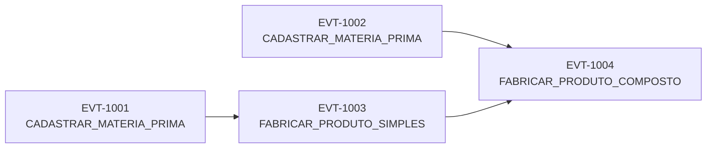

# Modelagem de Dados e Regras de Dominio

Este documento descreve a modelagem usada pelo projeto para representar rastreabilidade em uma cadeia de suprimentos com blockchain distribuida.

O foco da modelagem nao e movimentacao financeira nem saldo. O foco e registrar como itens sao criados, consumidos e combinados ao longo de um processo produtivo.

## 1. Ideia central do dominio

O projeto usa `SupplyChainEvent` como unidade basica da blockchain.

Cada evento representa a criacao de um item rastreavel novo.

Na pratica:

- uma materia-prima nasce em um evento de cadastro
- um produto simples nasce em um evento de fabricacao
- um produto composto nasce em outro evento de fabricacao
- os `input_ids` apontam para eventos criadores anteriores
- quando um `input_id` e usado em um evento valido, ele passa a ser considerado consumido

Essa simplificacao e deliberada. O sistema trata cada entrada como um item indivisivel de consumo unico para deixar a validacao semantica clara e para tornar demonstravel o ataque de gasto duplo adaptado ao contexto de supply chain.

## 2. Entidades do dominio

### Tipos de evento (`event_type`)

- `CADASTRAR_MATERIA_PRIMA`
- `FABRICAR_PRODUTO_SIMPLES`
- `FABRICAR_PRODUTO_COMPOSTO`

### Tipos de entidade (`entity_kind`)

- `raw_material`
- `simple_product`
- `composite_product`

### Papeis do ator (`actor_role`)

- `FORNECEDOR`
- `FABRICANTE`
- `MONTADORA`

### Mapeamento obrigatorio entre tipo, entidade e papel

| `event_type` | `entity_kind` esperado | `actor_role` esperado |
|---|---|---|
| `CADASTRAR_MATERIA_PRIMA` | `raw_material` | `FORNECEDOR` |
| `FABRICAR_PRODUTO_SIMPLES` | `simple_product` | `FABRICANTE` |
| `FABRICAR_PRODUTO_COMPOSTO` | `composite_product` | `MONTADORA` |

## 3. Fluxo minimo de composicao

O fluxo minimo aceito pela modelagem e este:



Leitura do fluxo:

- `EVT-1001` cria uma materia-prima
- `EVT-1002` cria outra materia-prima
- `EVT-1003` consome `EVT-1001` e gera um produto simples
- `EVT-1004` consome `EVT-1003` e `EVT-1002`, gerando um produto composto

Essa estrutura permite reconstruir a origem do produto final de forma recursiva.

## 4. Contrato do evento

O evento serializado em JSON usa os campos abaixo:

- `event_id`
- `event_type`
- `product_id`
- `product_name`
- `entity_kind`
- `actor_id`
- `actor_role`
- `timestamp`
- `input_ids`
- `metadata`

### Significado dos campos mais importantes

- `event_id`
  identificador unico do evento criador
- `product_id`
  identificador do item gerado pelo evento
- `input_ids`
  lista de `event_id`s de eventos criadores anteriores
- `metadata`
  dicionario livre, desde que serializavel em JSON

### Importante sobre `input_ids`

Neste projeto, `input_ids` referencia sempre eventos criadores anteriores, nao `product_id`s.

Exemplo:

- uma materia-prima e criada por `EVT-1001`
- um produto simples pode usar `input_ids: ["EVT-1001"]`
- um produto composto pode usar `input_ids: ["EVT-1002", "EVT-1003"]`

## 5. Exemplos de payload

### Cadastro de materia-prima

```json
{
  "event_id": "EVT-1001",
  "event_type": "CADASTRAR_MATERIA_PRIMA",
  "product_id": "ACO-CHAPA-01",
  "product_name": "Chapa de Aco",
  "entity_kind": "raw_material",
  "actor_id": "SIDERURGICA-CNPJ",
  "actor_role": "FORNECEDOR",
  "timestamp": "2026-04-06T14:30:00Z",
  "input_ids": [],
  "metadata": {
    "lot_id": "LOTE-ACO-01",
    "origem": "Usina 1",
    "peso_kg": 120
  }
}
```

### Fabricacao de produto simples

```json
{
  "event_id": "EVT-1002",
  "event_type": "FABRICAR_PRODUTO_SIMPLES",
  "product_id": "QUADRO-01",
  "product_name": "Quadro de Bicicleta",
  "entity_kind": "simple_product",
  "actor_id": "FABRICA-ESTRUTURA-CNPJ",
  "actor_role": "FABRICANTE",
  "timestamp": "2026-04-07T09:00:00Z",
  "input_ids": ["EVT-1001"],
  "metadata": {
    "lot_id": "LOTE-QUADRO-01",
    "linha_producao": "Linha A"
  }
}
```

### Fabricacao de produto composto

```json
{
  "event_id": "EVT-1003",
  "event_type": "FABRICAR_PRODUTO_COMPOSTO",
  "product_id": "BICICLETA-01",
  "product_name": "Bicicleta Urbana",
  "entity_kind": "composite_product",
  "actor_id": "MONTADORA-BIKE-CNPJ",
  "actor_role": "MONTADORA",
  "timestamp": "2026-04-08T10:00:00Z",
  "input_ids": ["EVT-1002", "EVT-1004"],
  "metadata": {
    "lot_id": "LOTE-BICICLETA-01",
    "modelo": "Urbana 500"
  }
}
```

No ultimo exemplo, o produto composto pode consumir um produto simples ja criado e outro insumo ainda disponivel, desde que o conjunto respeite as regras do validador.

## 6. Regras de validacao do dominio

As regras abaixo refletem o comportamento implementado no backend atual.

| Regra | Descricao |
|---|---|
| `R01` | `event_id` nao pode reaparecer no contexto conhecido. |
| `R02` | `CADASTRAR_MATERIA_PRIMA` deve ter `input_ids` vazio. |
| `R03` | `FABRICAR_PRODUTO_SIMPLES` deve ter ao menos um `input_id`. |
| `R04` | Todo `input_id` precisa apontar para evento anterior conhecido. |
| `R05` | Nenhum `input_id` pode ter sido consumido antes. |
| `R06` | Produto simples so pode consumir materias-primas. |
| `R07` | Produto composto pode consumir materia-prima, produto simples ou produto composto. |
| `R08` | Produto composto precisa consumir pelo menos um produto simples ou composto. |
| `R09` | O `actor_role` precisa ser coerente com o `event_type`. |
| `R10` | O `entity_kind` precisa ser coerente com o `event_type`. |

## 7. Confirmacao e pendencia

O projeto trabalha com dois estados praticos para os eventos observados pelo usuario:

- `pendente`
  evento ainda presente na mempool e nao confirmado em bloco da cadeia ativa local
- `confirmado`
  evento ja incluido em bloco da cadeia ativa local

Na rastreabilidade, a arvore de origem pode misturar nos confirmados e pendentes, porque um item pode estar em formacao antes de ser minerado.

## 8. Identificadores de rastreabilidade

O sistema foi pensado para rastrear um item por diferentes chaves conhecidas do dominio.

Hoje o backend permite consulta por:

- `event_id`
- `product_id`
- `metadata.lot_id`

Esses identificadores sao suficientes para recuperar:

- eventos confirmados
- eventos pendentes
- estado atual do item
- arvore recursiva de origem

## 9. Gasto duplo adaptado ao supply chain

Neste projeto, gasto duplo nao significa duas compras com o mesmo saldo.

Aqui ele aparece quando dois eventos concorrentes tentam consumir o mesmo insumo criador.

Exemplo:

- `EVT-1001` cria uma chapa de aco
- `EVT-1002` tenta fabricar um quadro usando `EVT-1001`
- `EVT-1003` tambem tenta fabricar outro quadro usando o mesmo `EVT-1001`

Os dois eventos nao podem coexistir na mesma historia canonica, porque o insumo foi modelado como consumo unico.

Se os dois entrarem em ramos concorrentes, o consenso decide qual cadeia permanece ativa e qual ramo vira fork descartado ou secundario.

## 10. Limites da modelagem atual

Esta modelagem foi feita para a demonstracao da V1. Ela nao cobre, por enquanto:

- fracionamento de lotes
- quantidade parcial de consumo
- estoque acumulado
- mistura de proporcoes
- assinatura digital do autor
- auditoria juridica de identidade

Mesmo com essas simplificacoes, a modelagem atual ja e suficiente para demonstrar formacao de produtos, rastreabilidade recursiva, conflito de consumo, fork e reorganizacao.
