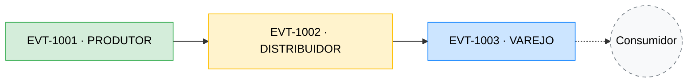

# Modelagem de Dados e Requisitos

Este documento define a arquitetura de dados e as regras de negócio para a Blockchain de Rastreabilidade da Cadeia de Suprimentos.

## 1. Mapeamento das Entidades e Atores

A rede se concentra no fluxo simples orientado para atender os requisitos mínimos do domínio: **Produtor → Distribuidor → Varejo**.

**Diagrama de Fluxo (Rastreabilidade via `input_ids`)**


### Papéis Selecionados (`actor_role`)
*   **`PRODUTOR`**: Ponto de origem. Responsável por cadastrar as matérias-primas e gerar o lote original do produto (Ex: Produtor colhendo e ensacando café).
*   **`DISTRIBUIDOR`**: Responsável pelo transporte e logística. Consome os lotes do Produtor e altera a posse e localização do ativo.
*   **`VAREJO`**: Ponto final. Recebe a mercadoria do distribuidor e a disponibiliza para venda direta ao cliente final.

### Fluxo de Eventos Escolhidos (`event_type`)
*   **`CADASTRAR_PRODUTO_RAIZ`**: Usado pelo Produtor. Criação de um ativo do zero, sem depender de itens pré-existentes na blockchain (não preenche a lista de dependências).
*   **`INICIAR_TRANSPORTE`**: Usado pelo Distribuidor. O distribuidor consome o produto raiz para atestar que pegou a carga para si.
*   **`RECEBER_NO_VAREJO`**: Usado pelo Varejista para atestar que o produto chegou e está disponível ao cliente.

---

## 2. Estrutura de Informação na Blockchain (Payloads JSON)

O formato acordado se baseia na entidade `SupplyChainEvent` exposta pelo processo Core. O segredo para amarrar um passo no outro será usar o campo `input_ids`.

### Cenário 1: O Produtor cadastra o material original
```json
{
  "event_id": "EVT-1001",
  "event_type": "CADASTRAR_PRODUTO_RAIZ",
  "product_id": "CAFE-LOTE-A1",
  "product_name": "Saca de Café 60kg",
  "actor_id": "FAZENDA-SAO-JOAO-CNPJ",
  "actor_role": "PRODUTOR",
  "timestamp": "2026-04-06T14:30:00Z",
  "input_ids": [],
  "metadata": {
    "certificacao": "Orgânico",
    "peso_kg": 60,
    "coordenadas_origem": "-19.9208,-43.9378"
  }
}
```

### Cenário 2: O Distribuidor transporta o produto
```json
{
  "event_id": "EVT-1002",
  "event_type": "INICIAR_TRANSPORTE",
  "product_id": "CAFE-LOTE-A1",
  "product_name": "Saca de Café 60kg",
  "actor_id": "LOGISTICA-RAPIDA-CNPJ",
  "actor_role": "DISTRIBUIDOR",
  "timestamp": "2026-04-08T09:00:00Z",
  "input_ids": ["EVT-1001"], 
  "metadata": {
    "placa_veiculo": "ABC-1234",
    "temperatura_carga_c": 18
  }
}
```

### Cenário 3: Recebimento no Varejo (Fim do Ciclo)
```json
{
  "event_id": "EVT-1003",
  "event_type": "RECEBER_NO_VAREJO",
  "product_id": "CAFE-LOTE-A1",
  "product_name": "Saca de Café 60kg",
  "actor_id": "SUPERMERCADO-XYZ-CNPJ",
  "actor_role": "VAREJO",
  "timestamp": "2026-04-10T10:00:00Z",
  "input_ids": ["EVT-1002"],
  "metadata": {
    "loja": "Filial Centro",
    "prateleira": "A3"
  }
}
```

---

## 3. Regras de Validação Semântica

A estrutura da transação só é confiável se houver regras estritas na *Mempool* e Consenso rejeitando quebras na lógica da cadeia de suprimento. 

| Regra | Descrição de Domínio Implementada na Blockchain |
|---|---|
| **R01 (Gênesis)** | A array `input_ids` vazia só é permitida de forma restrita para o tipo `CADASTRAR_PRODUTO_RAIZ`. |
| **R02 (Cadeia)** | Eventos do tipo `INICIAR_TRANSPORTE` e `RECEBER_NO_VAREJO` devem obrigatoriamente referenciar um `event_id` válido e existente dentro do array `input_ids`. |
| **R03 (Ordem)** | A sequência de publicadores `actor_role` em fluxos sucessivos deve impreterivelmente respeitar a ordem lógica (Produtor → Distribuidor → Varejo). |

### Vetores de Ataque Prevenidos pela Modelagem:
Além da consistência do negócio, a estrutura JSON amarrada descrita acima blinda a Blockchain contra 3 tipos de ataques cruciais (atendendo ao Critério de 20% da avaliação):

1. **Ataque de Gasto Duplo (Referência Clonada):** Um Nó Malicioso tentar enviar dois Caminhões de Distribuição diferentes usando a nota da mesma carga preenchida no seu apontamento (`input_ids: ["EVT-1001"]`). A primeira transação consome o ativo; a tentativa clonada seguinte gerará bloqueio criptográfico por "Double-Spend".
2. **Falsificação de Origem:** Um Distribuidor malicioso não consegue registrar unilateralmente um fluxo originário falso, garantindo que produtos piratas não consigam "surgir" magicamente no meio do transporte se a transação não estiver formalmente assinada por um ator estrito com o `actor_role: PRODUTOR`.
3. **Salto de Etapa Clandestino:** Um Varejista fraudulento não pode roubar uma carga referenciando o ID saltado diretamente do `PRODUTOR` sem passar por um `DISTRIBUIDOR` antes (regra R03).

---

## 4. Investigação Arquitetural: Otimização do Rastreio (SPV)

Em uma aplicação comercial em grande escala (ex: no celular do usuário do Varejo lendo o QR Code do café), não é sustentável obrigar o dispositivo móvel a baixar e validar todos os Gigabytes da blockchain do ano inteiro para rastrear apenas uma saca.

Por isso, propõe-se um mecanismo otimizado idêntico ao **Simple Payment Verification (SPV)** usado no Bitcoin:
1. **Light Nodes:** O nó do usuário final (aplicativo) faz o download constante apenas dos *Cabeçalhos de Bloco* (Block Headers), o que torna a sincronia milhares de vezes mais rápida e viável em redes móveis.
2. **Merkle Trees:** O bloco ideal deve agrupar todos os seus eventos na forma de uma Árvore de Merkle e transcrever apenas o hash final sumarizado — a *Merkle Root* — no cabeçalho.
3. **Verificação Instantânea:** Para atestar que a origem do empacotamento de café `"EVT-1001"` é fidedigna sem precisar baixar milhares de outras sacas contidas em um bloco, o aplicativo do cliente apenas solicita à rede P2P um "Comprovante de Merkle". A rede retorna um pequeno caminho (Merkle Path). O celular processa esse pequeno caminho de volta à raiz sem expor outros dados e valida o rastreio localmente de forma extremamente limpa.
